# KAG SecOps Dashboard


A self-hosted Microsoft 365 security operations dashboard that replaces five separate admin portals — Entra ID, Intune, Defender, Compliance, and Service Health — with one live view, built against a real M365 tenant using Microsoft Graph.

<p align="center">
  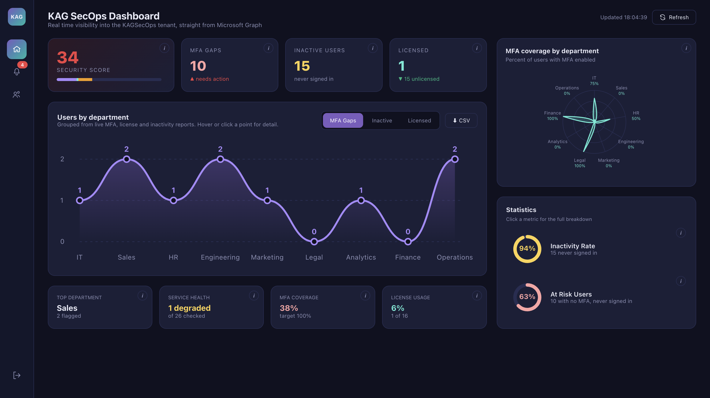
</p>

---

## Problem → Solution

IT support and cloud teams routinely check MFA status, license assignment, inactive accounts, and service health across separate M365 admin panels. That's slow, repetitive, and easy to lose track of. This dashboard pulls all four signals from Microsoft Graph, correlates them, and surfaces the ones that actually need action — not just raw counts.

## Features

- **Live data**, not a static export — PowerShell scripts hit Microsoft Graph directly against a real tenant, a FastAPI backend serves the results, and a one-click Refresh button re-runs everything on demand
- **Security Score** built from real weighted contributions (MFA coverage, license coverage, service health) rather than an arbitrary single number, with a full point-by-point breakdown on click
- **Compounded risk detection** — cross-references the MFA report against the inactivity report to surface users who combine *both* risk factors at once, a signal neither report shows on its own
- **Click-to-drill-down everywhere** — every bar, chart point, and department breakdown expands to show the exact users behind the number, instead of an ambiguous "2 of 3"
- **Searchable, filterable lists** for MFA gaps, inactive users, license status, and service health
- **Employee directory** with live search across name and department
- **Notifications** generated from the same live data (not a separate hardcoded feed), with read/unread state
- Smooth flip-in card expansion, hover states, and a department radar chart, tuned over several rounds of visual iteration (see *Design & Iteration* below)

## Architecture

```
PowerShell 7 + Microsoft.Graph SDK
        │  (app-only auth, client credentials flow)
        ▼
Azure AD App Registration ──► Microsoft Graph API
        │
        ▼
CSV reports (Docs/*.csv)
        │
        ▼
FastAPI backend (Python)  ──►  GET /api/mfa-status
                                GET /api/license-report
                                GET /api/inactive-users
                                GET /api/service-health
                                POST /api/refresh
        │
        ▼
React frontend (localhost:3000)
```

## Tech stack

`PowerShell 7` · `Microsoft.Graph PowerShell SDK` · `Python` · `FastAPI` · `uvicorn` · `React` · `Microsoft Entra ID` · `Azure AD App Registration`

## How to run locally

**Backend:**
```bash
cd ~/Documents/KAGSecOps/Backend
uvicorn main:app --reload --port 8000
```

**Frontend:**
```bash
cd ~/Documents/KAGSecOps/dashboard
npm start
```

Requires a `.env` file with `TENANT_ID`, `CLIENT_ID`, and `CLIENT_SECRET` for an Azure AD app registration with `User.Read.All`, `AuditLog.Read.All`, `DeviceManagementManagedDevices.Read.All`, `ServiceHealth.Read.All`, and `UserAuthenticationMethod.Read.All` application permissions.

## Screenshots

| | |
|---|---|
| **Overview** — Security score, MFA gaps, department chart |  |
| **MFA gap drill-down** — click any bar to see the exact users | 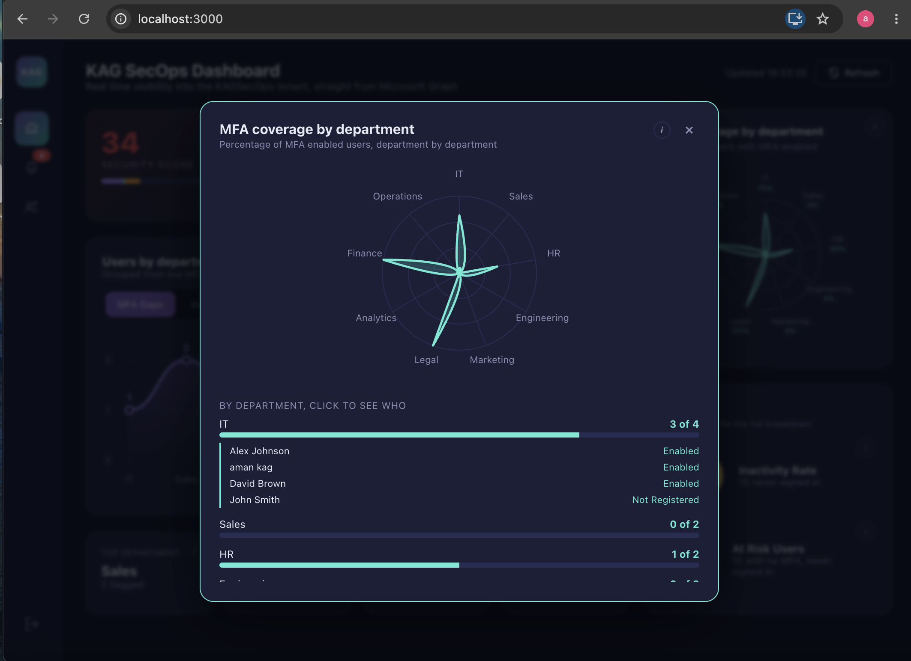 |
| **Compounded risk metric** — no MFA + never signed in, cross-referenced | 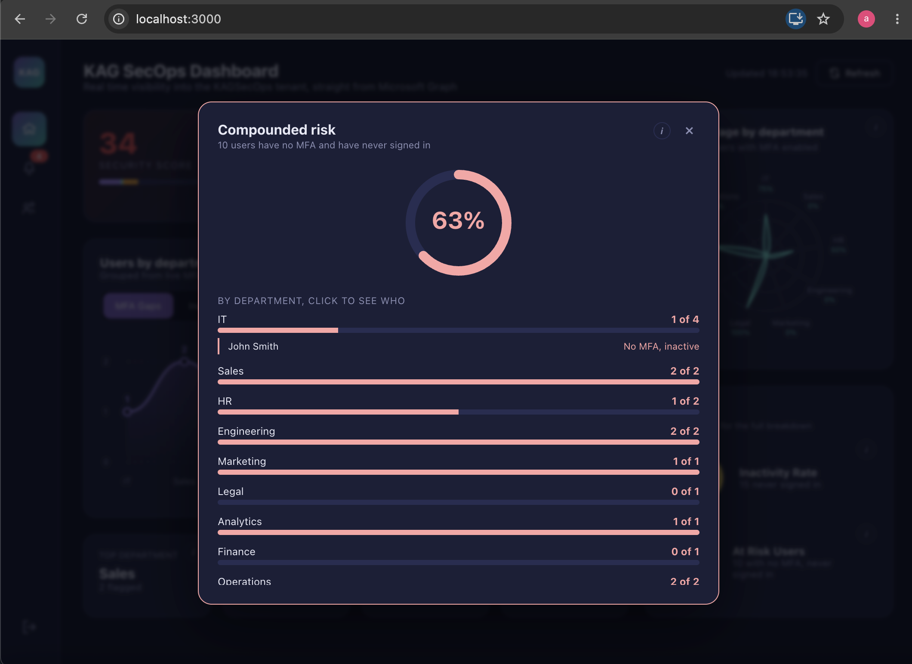 |
| **Employee directory** — searchable by name or department | 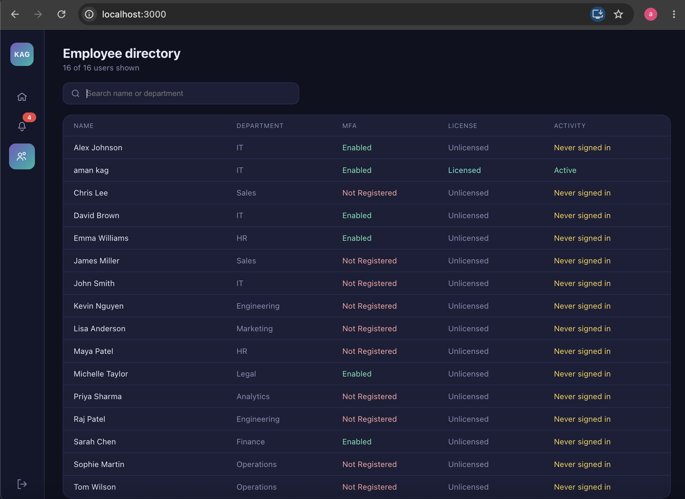 |
| **Notifications** — generated live from the same data, read/unread state | 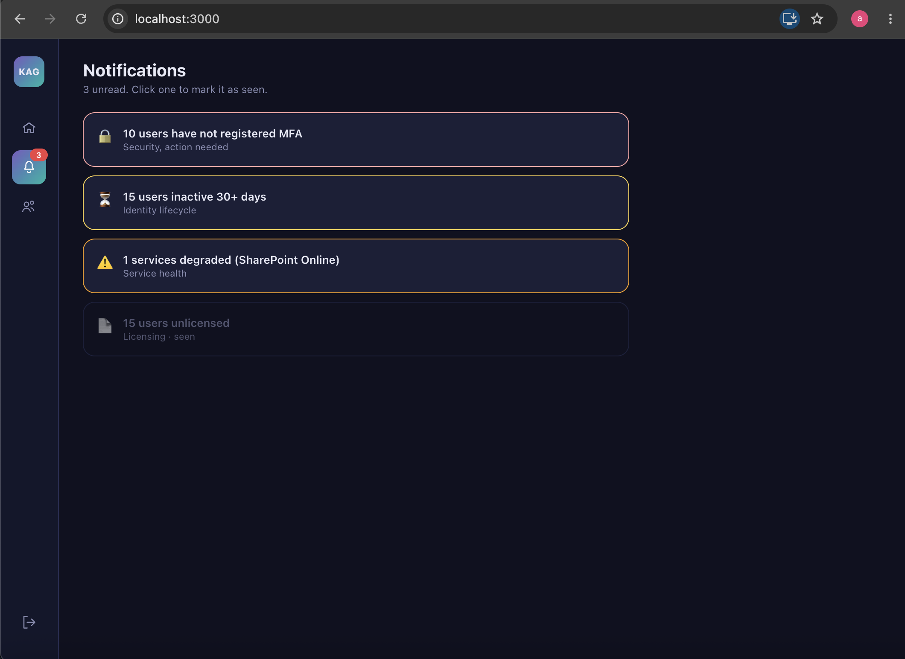 |

<details>
<summary><strong>Setup & automation screenshots</strong> (PowerShell scripts, Azure app registration, API — click to expand)</summary>

| | |
|---|---|
| Bulk user creation via `Create-Users.ps1` | 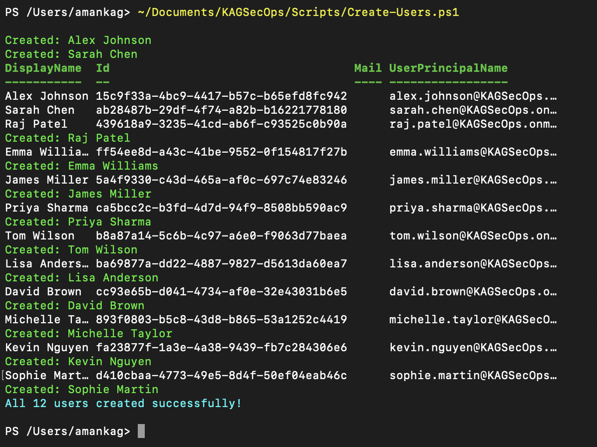 |
| All users listed in Microsoft 365 Admin Center | 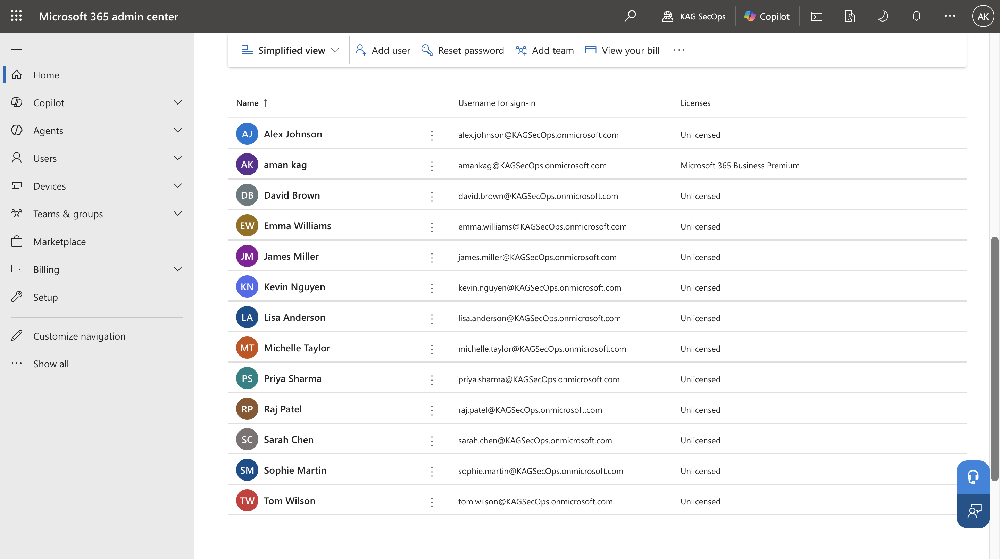 |
| Azure App Registration overview | 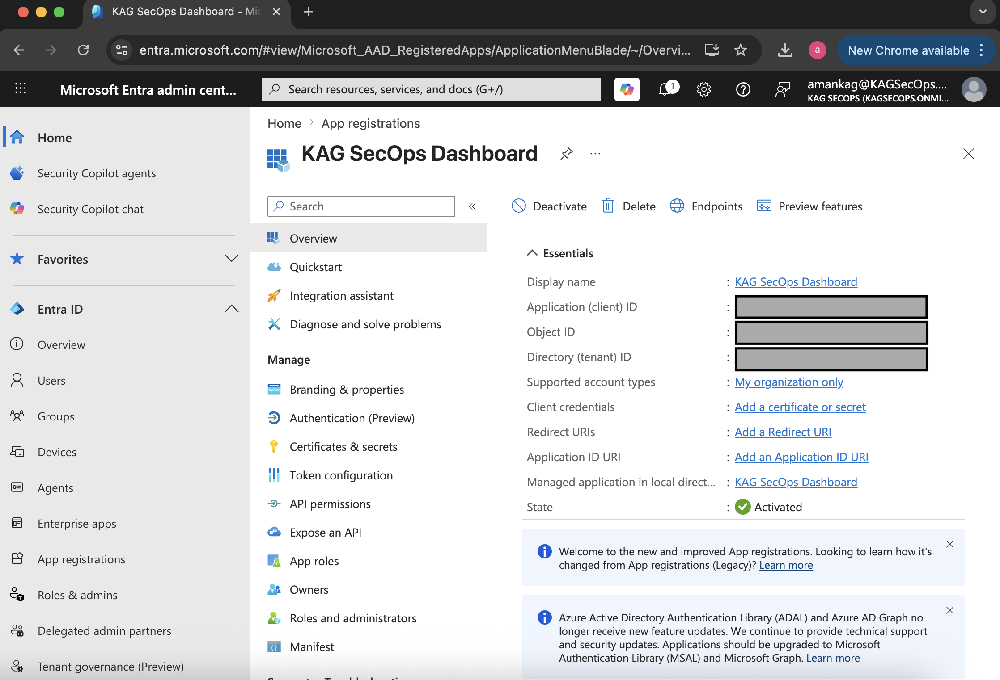 |
| API permissions before admin consent | 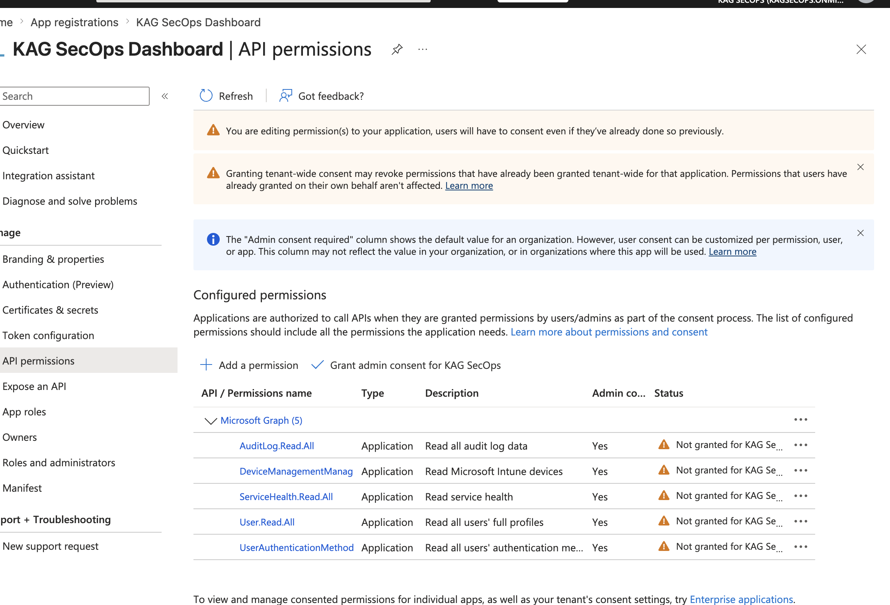 |
| API permissions after admin consent granted | 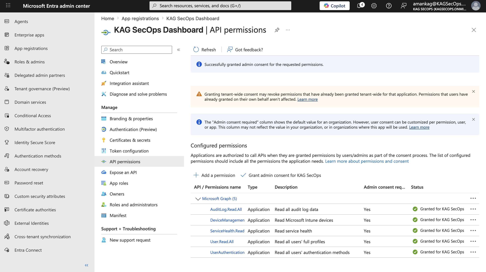 |
| `Get-MFAStatus.ps1` output | 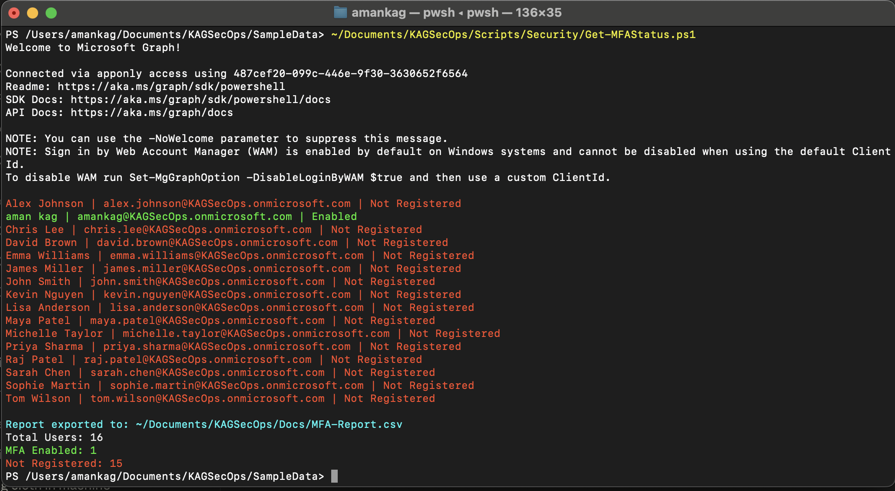 |
| `Get-ServiceHealth.ps1` output | 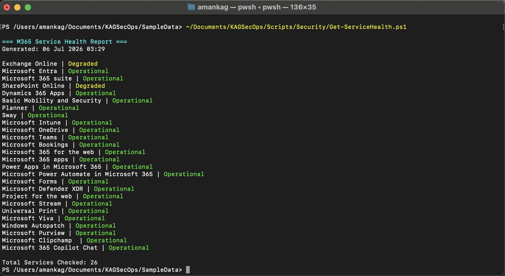 |
| `Get-InactiveUsers.ps1` output | 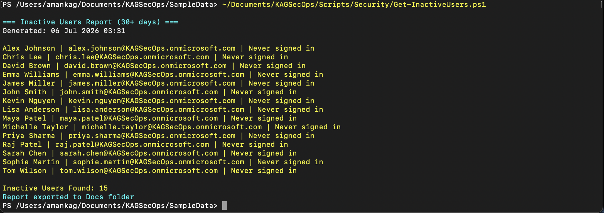 |
| `Export-LicenseReport.ps1` output | 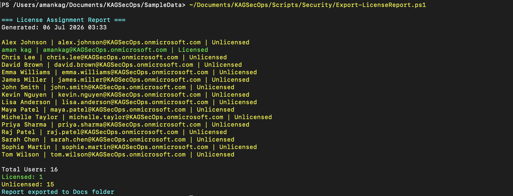 |
| FastAPI backend running (`uvicorn`) | 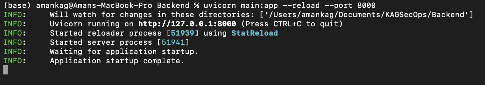 |
| API root endpoint responding | 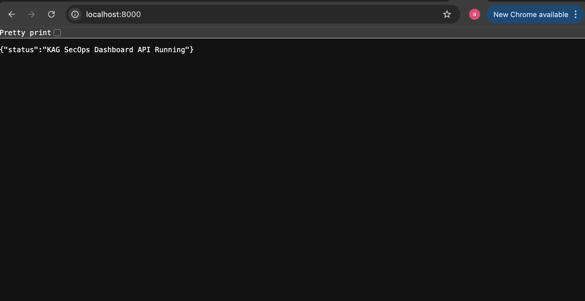 |
| Live MFA data returned as raw JSON | 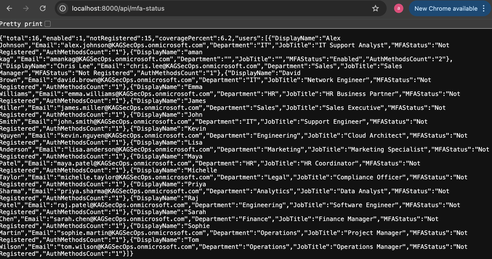 |
| `/docs` Swagger API documentation | 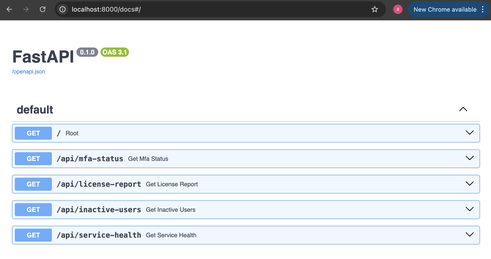 |

</details>

## Design & iteration

This wasn't a single build — the interface went through several rounds of correction before it was worth showing anyone. Early versions had inconsistent card sizing, metrics duplicated across two sections for no reason, and numbers like "2 of 3" with no way to see who the 2 actually were. Coming from building the Manufacturing Quality Dashboard in Power BI, where card alignment, avoiding redundant visuals, and giving people a path from summary number to underlying detail decide whether a dashboard gets used or ignored, I pushed each pass toward:

- Removing duplicated metrics (Statistics originally just repeated MFA Coverage and License Usage shown elsewhere — replaced with two signals that don't exist anywhere else on the dashboard: Inactivity Rate, and a compounded "At Risk Users" metric built by cross-referencing MFA and inactivity data)
- Click-to-drill-down on every bar and chart point, so a number is never a dead end
- Consistent grid alignment across every card and section
- A security score whose composition is traceable, not a black-box number

The PowerShell automation, Graph API queries, FastAPI backend, and the overall system design are my own work. For the React frontend implementation, I worked with Claude (Anthropic's AI assistant) as a coding tool, directing the layout, interaction design, and visual structure through multiple correction cycles, then had a couple of IT professional colleagues review the working build, who suggested a few minor JavaScript refinements before calling it production ready. Without the dashboarding judgment from the Power BI work behind it, this would have shipped as a flat, generic layout — the placement, hierarchy, and drill-down structure are what turned it into something people would actually want to use.

## Lessons learned

- Cross-referencing two datasets (MFA status × inactivity) surfaces risk that neither report shows alone, and is a better security signal than either metric individually
- Admin/service accounts frequently lack a Department attribute in Entra ID — worth handling explicitly (an "Unassigned" bucket) rather than letting those users silently disappear from department-level views
- A dashboard's numbers need to always be traceable to the underlying record; a percentage or count with no drill-down is a dead end for anyone actually trying to act on it

## Known limitations

- Trial tenant data — MFA and inactivity distributions reflect a small seeded user set, not a real organization
- Service health currently checks a defined list of core M365 services rather than the full catalog
